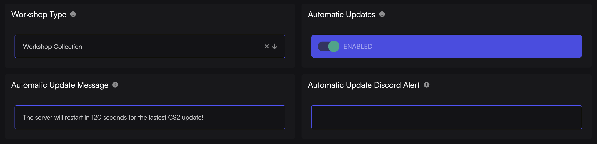

At Game Host Bros, we have true automatic updates for Counter Strike 2. This means as soon as an update comes out, within 120 seconds your server will send a message to all the players on the server and restart it.

:::note
There is no way to interrupt this once it starts. If you're running an important match, then you must disable the updater.
:::

## How to Enable/Disable Automatic Updates

This is how you can turn on automatic updates for your Counter Strike 2 server.

1. Log in to the [Game Host Bros Panel](https://panel.gamehostbros.com/).
2. Select your server.
3. Go to `Configuration > Startup Parameters`.
4. Find `Automatic Updates` and toggle it to the desired position and restart your server.

## How to Change The Update Message Sent to Players

By default, your CS2 server will send the message to all the players saying "The server will restart in 120 seconds for the latest CS2 update!". You can adjust this message by going to the following settings.

1. Log in to the [Game Host Bros Panel](https://panel.gamehostbros.com/).
2. Select your server.
3. Go to `Configuration > Startup Parameters`.
4. Find and change the `Automatic Update Message` field and restart your server.

## Sending a Discord Alert

You can also send a Discord alert to one of your channels using a Webhook. This is handy for checking your server after an update to make sure it's all running ok.

1. Create a channel in your Discord and a Webhook for that channel.
2. Log in to the [Game Host Bros Panel](https://panel.gamehostbros.com/).
2. Select your server.
3. Go to `Configuration > Startup Parameters`.
4. Find and change the `Automatic Update Discord Alert` and paste in your Webhook URL.
5. Restart your server.

## Frequently Asked Questions

**Q.** Can I change the Discord message?  
**A.** At this time that's not possible.

**Q.** How often does the server check for updates?  
**A.** The CS2 server checks for updates every 60 seconds.

**Q.** If an update is about to happen, can I stop it?  
**A.** No. You must disable the automatic update and restart your server.