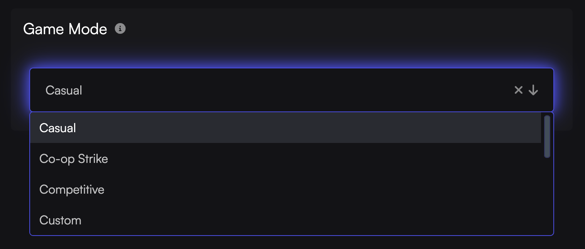

Here is how you change your CS2 server Game Mode from Competitive to something else.

1. Visit [Game Host Bros Panel](https://panel.gamehostbros.com/) and log in.
2. Select your Counter Strike 2 server.
3. Go to `Configuration > Startup Parameters`.
4. Choose your desired `Game Mode` from the dropdown menu.

5. Restart your server.

Each game mode has its own config files you need to edit to change settings. You can find how to edit your [gamemode configs here](/games/counter-strike-2/config-files/)