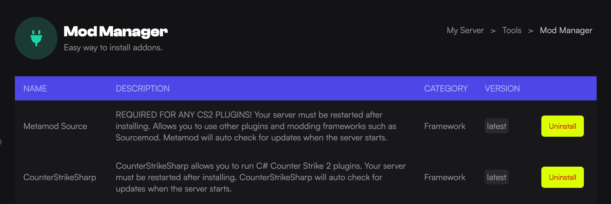

Using our Mod Manager, you can get Metamod, CounterStrikeSharp and some plugins installed on your CS2 server with a single click.

:::danger
Metamod and CounterStrikeSharp both must be installed before any other plugin.
:::

## Installing Metamod & CounterStrikeSharp

The first thing you need to do is to install Metamod Source. This is the base foundation that most plugins use.

1. Load the [Game Host Bros Panel](https://panel.gamehostbros.com/).
2. Select your server.
3. In the left-hand menu, click `Tools > Mod Manager`.
4. Look for `Metamod Source` & `CounterStrikeSharp`.

5. Click the Install buttons for both then restart the server.

At Game Host Bros, we automatically update Metamod & CounterStrikeSharp every time your server starts.

## Installing Plugins

We have some CounterStrikeSharp plugins already added to our 1-click Mod Manager.

1. Load the [Game Host Bros Panel](https://panel.gamehostbros.com/).
2. Select your server.
3. In the left-hand menu, click `Tools > Mod Manager`.
4. Look for the plugin you want to install.
5. Click the Install button then restart the server.

You can check if the plugin is loaded by typing `css_plugins list` into the console. If you manually need to install a plugin, the most common folder you need to upload them to is `/game/csgo/addons/counterstrikesharp/plugins`.

## CS2 Plugins List

Here is a list of all the current Counter-Strike 2 plugins you can manually install on your server.

    <button class="tag-button c-rounded c-padding-s active" data-tag="All">All</button>
    <button class="tag-button c-rounded c-padding-s" data-tag="Administration">Administration</button>
    <button class="tag-button c-rounded c-padding-s" data-tag="Gameplay">Gameplay</button>
    <button class="tag-button c-rounded c-padding-s" data-tag="Fun">Fun</button>
    <button class="tag-button c-rounded c-padding-s" data-tag="Modes">Modes</button>
    <button class="tag-button c-rounded c-padding-s" data-tag="Stats">Stats</button>

<input type="search" class="searchInput c-rounded c-padding-s" placeholder="Type here to search.....">

Nothing found, please try another term

|Plugin Name|Tags|Description|
|:----|:----|:----|
|[LanguageManagerPlugin](https://github.com/aprox2/GeoLocationLanguageManagerPlugin)|Administration|Changes the players language based on their location.|
|[cs2-VIPCore](https://github.com/partiusfabaa/cs2-VIPCore)|Administration|VIP API for other VIP plugins.|
|[cs2-simple-discord-report](https://github.com/onurcanertekin/cs2-simple-discord-report)|Administration|Send player !report directly to Discord.|
|[CS2_AntiVPN](https://github.com/NockyCZ/CS2_AntiVPN)|Administration|Block players from specific countries or VPN users.|
|[NameChecker-cs2](https://github.com/Iksix/NameChecker-cs2)|Administration|Checks the names of the players when connecting.|
|[CS2-RecordAbuse](https://github.com/daffyyyy/CS2-RecordAbuse)|Administration|Allows admins to record demos with a command.|
|[ZombieSharp](https://github.com/oylsister/ZombieSharp/)|Gameplay|Zombie Escape Gamemode plugin for Counter-Strike 2.|
|[cs2-css-flashlight](https://github.com/creazy231/cs2-css-flashlight)|Gameplay|Adds a flashlight to the server.|
|[NightVip](https://github.com/jockii/NightVip)|Administration|Gives player basic VIP privileges, but for a certain period of time.                                                                                         &nbsp;|
|[cs2-hideadmin](https://github.com/DeadSwimek/cs2-hideadmin)|Administration|Hide admins from the player list.|
|[cs2-ctban](https://github.com/DeadSwimek/cs2-ctban)|Gameplay|Can ban player from connecting to CTs.|
|[Cs2Telegram](https://github.com/prethink/Cs2Telegram/)|Administration|Manage your CS2 server using a telegram bot.|
|[cs2-simple-guns-menu](https://github.com/onurcanertekin/cs2-simple-guns-menu)|Gameplay|Add a chat gun menu to your server.|
|[CS2-DeleteLogs](https://github.com/daffyyyy/CS2-DeleteLogs)|Administration|Automatically delete logs from your server.|
|[CS2-ShowDamage](https://github.com/ABKAM2023/CS2-ShowDamage)|Fun|Displays information about inflicted damage on the screen.|
|[cs2_teleportprotection](https://github.com/Cruze03/cs2_teleportprotection)|Gameplay|Protect players for X seconds when they touch trigger_teleport.|
|[cs2-mapchooser](https://github.com/justinnobledev/cs2-mapchooser)|Administration|This plugin handles basic map voting features like nominate, rtv, extend and end of map voting.|
|[CS2-Check-Cheats](https://github.com/ABKAM2023/CS2-Check-Cheats)|Administration|Assist administrators in checking suspicious players for the use of cheats.|
|[cs2-deathrun-manager](https://github.com/leoskiline/cs2-deathrun-manager)|Gameplay|Deathrun Manager for CounterStrikeSharp Framework CS2.|
|[cs2-Adminchat](https://github.com/johnoclockdk/cs2-Adminchat)|Administation|Allow admins to chat with each other.|
|[SuperheroPlugin](https://github.com/aprox2/SuperheroPlugin)|Fun|CSS based superhero plugin.|
|[SLAYER_Noscope](https://github.com/zakriamansoor47/SLAYER_Noscope)|Gameplay|This plugin disables scope of weapons like AWP, scout, etc.|
|[DiscordStatus](https://github.com/Tian7777/DiscordStatus)|Fun|Monitor your server by sending cute embeds to Discord.|
|[CS2-WarnSystem](https://github.com/ABKAM2023/CS2-WarnSystem)|Administration|Issue warnings to players who violate the rules|
|[cs2_IPBlocker](https://github.com/PhantomYopta/cs2_IPBlocker)|Administration|Blocks messages that contains an IP.|
|[CS2-SimpleAdmin](https://github.com/daffyyyy/CS2-SimpleAdmin)|Administration|Manage your Counter-Strike 2 server by simple commands.|
|[Welcome](https://github.com/Klayeryt/Welcome)|Fun|Send a welcome message when the player joins the server.|
|[CS2-AntiTeamFlash](https://github.com/Franc1sco/CS2-AntiTeamFlash)|Gameplay|Simple anti team flash plugin.|
|[cs2-countdown](https://github.com/DeadSwimek/cs2-countdown)|Fun|A simple countdown for admins.|
|[flashbattles](https://github.com/Siomek101/flashbattles)|Fun|Makes you swap with the flasher if you get flashed.|
|[IgnoreMessages](https://github.com/KillStr3aK/IgnoreMessages)|Administration|This plugin can remove the messages from the chat like an auto moderator.|
|[cs2-BlockerPasses](https://github.com/partiusfabaa/cs2-BlockerPasses)|Gameplay|Blocks passages if there are not a certain number of players on the server.|
|[CS2-SteamGroupRestrict](https://github.com/BMathers35/CS2-SteamGroupRestrict)|Administration|Restrict commands for players who are not in your Steam group.|
|[cm-cs2-colorsay](https://github.com/Challengermode/cm-cs2-colorsay)|Fun|Adds color to your chat messages.|
|[cs2-specialrounds](https://github.com/DeadSwimek/cs2-specialrounds)|Fun|Randomly generates special rounds.|
|[CSS-CreateCustomCommands](https://github.com/HerrMagiic/CSS-CreateCustomCommands)|Administration|Create custom responses for messages such as !discord or !help.|
|[cm-cs2-defaultskins](https://github.com/Challengermode/cm-cs2-defaultskins)|Gameplay|Enforce default skins on players.|
|[Economy](https://github.com/gerod220/Economy)|Fun|Plugin for creating economic relations between players on cs2 servers.|
|[ResourcePrecacher](https://github.com/KillStr3aK/ResourcePrecacher)|Administration|Precache any Resource in CS2.|
|[cs2_chat2vk](https://github.com/xtance/cs2_chat2vk)|Administration|Send chat messages to VK.|
|[CSS-Regenerate-Health](https://github.com/HerrMagiic/CSS-Regenerate-Health)|Fun|!medic, !heal or !regen to regenerate your health to full.|
|[Medic](https://github.com/Quake1011/Medic)|Fun|Allows you to refill your health.|
|[CS2-ChatManager](https://github.com/BMathers35/CS2-ChatManager)|Administration|Allows managing CS2 chat messages.|
|[cs2-spawntools](https://github.com/justinnobledev/cs2-spawntools)|Gameplay|Dynamically create spawns per map.|
|[deleteBuyZones](https://github.com/ItsChase88/deleteBuyZones)|Administration|Delete all buyzones for a map.|
|[Force-AllTalk](https://github.com/hg-fortis/Force-AllTalk)|Administration|A very simple plugin that enables every 'talk' related convar.|
|[WeaponPurchaseCommand](https://github.com/oylsister/CS2-WeaponPurchaseCommand)|Gameplay|Buy weapons using commands.|
|[CS2_BombsitesRestrict](https://github.com/NockyCZ/CS2_BombsitesRestrict)|Gameplay|Restricts the random bombsite of each round.|
|[CS2-Parachute](https://github.com/Franc1sco/CS2-Parachute)|Fun|Parachute when you press E in the air.|
|[PugPlugin-CSSharp](https://github.com/CharlesBarone/PugPlugin-CSSharp)|Modes|CS2 PugPlugin for setting up 10man servers.|
|[CS2_DiscordRelayEnhanced](https://github.com/hobsRKM/CS2_DiscordRelayEnhanced)|Administration|This plugin sends chat messages from players to your Discord channel.|
|[VoteBKM](https://github.com/ebpnk/VoteBKM)|Administration|Plugin for blocking players by voting.|
|[Weapon-Spawner](https://github.com/ebpnk/Weapon-Spawner)|Gameplay|Gives players weapons from a chat command.|
|[CS2-VipManager](https://github.com/1Mack/CS2-VipManager)|Administration|Plugin for CS2 that stores admins in mysql and apply permissions on the game.|
|[cs2_Setbothp](https://github.com/jackson-tougher/cs2_Setbothp)|Gameplay|Just set your HP value for bots.|
|[ScoutsNKnives](https://github.com/hg-fortis/ScoutsNKnives)|Modes|Classic ScoutsNKnives with a bit of customization.|
|[CS2-Tags](https://github.com/daffyyyy/CS2-Tags)|Fun|Adds tags before player names in chat and the scoreboard.|
|[CS2-RanksPoints](https://github.com/ABKAM2023/CS2-RanksPoints)|Stats|RanksPoints system is based on a simple principle: players perform various actions in the game, resulting in either gaining or losing experience points.|
|[cs2-vip](https://github.com/DeadSwimek/cs2-vip/)|Administration|A VIP system for CS2.|
|[CS2-CallAdmin](https://github.com/1Mack/CS2-CallAdmin)|Administration|Plugin for CS2 that reports a player on game and send a webhook message to discord.|
|[css-C4-Timer](https://github.com/R0mz1k/css-C4-Timer)|Fun|This plugin adds countdown to c4 bomb explosion to your server.|
|[cs2-ranks](https://github.com/partiusfabaa/cs2-ranks)|Stats|An in depth ranking system for CS2. Simmilar to Levels Ranks for CSGO.|
|[CS2-BotSlay](https://github.com/Dliix66/CS2-BotSlay)|Gameplay|Slay all bots when the last player dies.|
|[cs2-rockthevote](https://github.com/abnerfs/cs2-rockthevote)|Administration|Players can !rtv using the stock CS2 map chooser.|
|[css-basic-admin](https://github.com/Hackmastr/css-basic-admin)|Administration|A basic admin plugin for CSSharp.|
|[CS2-PlayersBet](https://github.com/Dliix66/CS2-PlayersBet)|Fun|Allows players to bet on the next winning team.|
|[SharpTimer](https://github.com/DEAFPS/SharpTimer/)|Modes|A timer for Surf, Bhop, KZ and MG maps.|
|[cs2_ShowPlayersInfo](https://github.com/jackson-tougher/cs2_ShowPlayersInfo)|Administration|Show info about players in game chat(UserID, Name, SteamID64)|
|[CS2_SteamRestrict](https://github.com/K4ryuu/CS2_SteamRestrict)|Administration|Enforce minimum CS2 playtime and Steam level requirements, and customize restrictions for Prime and non-Prime players.|
|[CS2-Kill-Plugin](https://github.com/Quantor97/CS2-Kill-Plugin)|Fun|Allows players to suicide via chat by entering "!suicide" or "/suicide"|
|[cs2-SimpleResetScore](https://github.com/stefanx111/cs2-SimpleResetScore)|Stats|This plugin resets your score with command !rs|
|[cs2_blockradiocommands](https://github.com/Cruze03/cs2_blockradiocommands)|Administration|A CSSharp plugin to block all radio commands.|
|[CS2-AutoUpdater](https://github.com/dran1x/CS2-AutoUpdater)|Administration|Automatically checks for a server update and restarts your server while notifying players in game.|
|[CS2-Practice-Plugin](https://github.com/CHR15cs/CS2-Practice-Plugin)|Modes|Open Source Plugin for Counterstrike 2 based on CounterStrikeSharp|
|[Discord-cs2-ReportSystem](https://github.com/PhantomYopta/-Discord-cs2-ReportSystem)|Administration|Allows players to send reports (complaints) about other players straight to a Discord channel.|
|[CS2_DiscordRelay](https://github.com/K4ryuu/CS2_DiscordRelay)|Administration|This plugin sends chat messages from players to your Discord channel.|
|[CS2 Simple Ranks](https://github.com/K4ryuu/CS2_SimpleRanks)|Stats|Allows you to create an unlimited number of ranks with customizable experience thresholds and rank colors.|
|[MatchZy](https://github.com/shobhit-pathak/MatchZy)|Modes|For running and managing practice/pugs/scrims/matches with easy configuration!|
|[CS2 Damage Info](https://github.com/K4ryuu/CS2_DamageInfo)|Gameplay|Displays the amount of damage players have inflicted on the victim's HP and Armor, as well as the hit groups they have hit.|
|[CS2_PlaytimeTracker](https://github.com/K4ryuu/CS2_PlaytimeTracker)|Stats|This plugin allows the players to check their playtime, team-specific playtime, and death or alive playtime.|
|[CS2 Connection Logs](https://github.com/WidovV/cs2-connectionlogs)|Administration|This plugin adds players to a database to track when they join with their IP. It prints to discord through a webhook when a player join (with their IP) and leaves.|
|[cs2-LiteVIP](https://github.com/partiusfabaa/cs2-LiteVIP/)|Administration|Plugin for CS2 with basic VIP functions.|
|[Get SteamID](https://csdevs.net/resources/get-steamid.465/)|Administration|A simple plugin that adds display of all types of Steam IDs to chat.|
|[AFKManager](https://github.com/NiGHT757/AFKManager)|Gameplay|A simple AFK Manager plugin for CS2.|
|[Lite MapChooser](https://github.com/PhantomYopta/LiteMapChooser)|Administration|The most lightweight and functional plugin for changing maps, rtv and nominations|
|[Auto Map Changer](https://github.com/skaen/Auto-Map-Changer/)|Administration|Automatically changes the map when not active to the one specified in the config.|
|[ColoredSmokeTeam](https://csdevs.net/resources/coloredsmoketeam.458/)|Fun|Allows you to change the color of smoke grenades.|
|[ResetScore](https://csdevs.net/resources/resetscore.456/)|Stats|Reset statistics (kills, deaths, assists, head-killers, damage). The same as !rs on CSGO.|
|[Connect Info](https://csdevs.net/resources/connect-info-geolite-28-10-2023.453/)|Administration|Displays a message to everyone in the chat when a player connects (with information about the city and country) and disconnects.|
|[RandomStartMap](https://csdevs.net/resources/randomstartmap.444/)|Administration|Sets a random map when the server is started.|
|[PugSharp](https://github.com/Lan2Play/PugSharp)|Modes|PugSharp is a PUG System Plugin for CS2 based on the awesome CounterStrikeSharp.|
|[AutoClearMaps](https://csdevs.net/resources/autoclearmaps.466/)|Administration|Automatically deletes the default maps to save disk space.|
|[cs2-advertisement](https://github.com/partiusfabaa/cs2-advertisement)|Administration|A plugin for cs2 that allows you to show ads in chat/center/panel|
|[CS2_Speedometer](https://github.com/PhantomYopta/CS2_Speedometer)|Gameplay|Just a speedometer for CS2|
|[CS2Retake](https://github.com/LordFetznschaedl/CS2Retake)|Modes|Implementation of a Retake plugin for CS2 using CounterStrikeSharp|
|[Weapon-Restrict](https://github.com/Quake1011/Weapon-Restrict)|Gameplay|Allows CS2 server owners to block/whitelist players from a country based on IP|
|[CS2 Mini Admin](https://github.com/partiusfabaa/cs2-MiniAdmin)|Administration|Adds basic administrator functions|
|[CS2 Instant Defuse](https://github.com/LordFetznschaedl/CS2InstantDefuse)|Gameplay|This plugin allows the bomb to be instantly defused|
|[CS2 Rcon](https://github.com/LordFetznschaedl/CS2Rcon)|Administration|Enables RCON inside CS2|
|[MapConfigurator](https://github.com/ManifestManah/MapConfigurator)|Administration|Easily create unique configuration files on a per-map basis.|
|[NoBlock](https://github.com/ManifestManah/NoBlock)|Gameplay|Players will then be allowed to walk through each other without being stopped due to collision settings, regardless of their team affiliation.|
|[MetaCommandsBlocker](https://github.com/ManifestManah/MetaCommandsBlocker)|Administration|Block your server's Metamod, plugins and modules version from players.|
|[CS2_Whitelist](https://github.com/PhantomYopta/CS2_WhiteList)|Administration|Restricts access to the server for Steam IDs listed in the whitelist.|
|[DeathmatchPlugin](https://github.com/charliethomson/DeathmatchPlugin)|Modes|Deathmatch plugin, with player configurable loadouts, killstreaks, and a (mid) buy menu integration.|
|[K4-System](https://github.com/K4ryuu/K4-System)|Stats|Playtime tracker, statistical records, and player ranks. Additionally, it includes VIP functions and admin commands for added functionality.|
|[DisableWeapons](https://github.com/sphaxa/DisableWeaponsPRG)|Gameplay|Add the weapons you want to be completely restricted from the game.|
|[cs2_Advertisements_Database](https://github.com/johnoclockdk/cs2_Advertisements_Database)|Administration|Advertisements plugin with database for multiple server|
|[CS2 Jailbreak](https://github.com/destoer/Cs2Jailbreak)|Modes|Jailbreak plugin for CS2|
|[cs2-vipguns](https://github.com/DeadSwimek/cs2-vipguns)|Administration|Allow players with VIP to buy specific guns|
|[cs2-showdamage](https://github.com/abnerfs/cs2-showdamage)|Gameplay|Simple show damage plugin for CS2|
|[CS2-AutoBalancePlugin](https://github.com/GabrielBigardi/CS2-AutoBalancePlugin)|Gameplay|Auto Balance Plugin for CS2 using CounterStrikeSharp|
|[cs2-chatspy](https://github.com/skaen/cs2-chatspy)|Administration|Catches the enemy team's message and sends them to the administrators|
|[CS2 Teleport](https://github.com/oylsister/CS2-TeleportCommand/)|Gameplay|Advanced teleport command plugin|
|[cs2-killfeed-filter](https://github.com/abnerfs/cs2-killfeed-filter)|Gameplay|Show players only their own killfeed. Perfect for deathmatch servers.|
|[SimpleAdmin](https://github.com/connercsbn/SimpleAdmin)|Administration|This is a very basic ban/unban/kick plugin for CounterStrikeSharp that uses SQLite.|
|[GoSpec](https://github.com/joahreason/GoSpec)|Gameplay|Allows players to type !spec in chat|
|[NoKnifeDamage](https://github.com/Precision-Gaming/NoKnifeDamagePRG)|Gameplay|Stops players from taking knife damage. Perfect for AWP servers.|
|[WorkshopDefaultMap](https://github.com/Cruze03/cs2_WorkshopDefaultMap/)|Administration|Allows you to choose your own CS2 start workshop map.|
|[TeamBets](https://github.com/NiGHT757/TeamBets)|Fun|Place a bet on what team you think is going to win.|
|[Weapon-Restrict](https://github.com/Quake1011/Weapon-Restrict)|Gameplay|Restrict the user of certain weapons|
|[Simple Spawn Protection](https://github.com/Hackmastr/css-spawn-protection)|Gameplay|Grants spawn protection to players|
|[No Zoom Rounds](https://github.com/PhantomYopta/CS2_Nozoom-rounds-voting)|Fun|Allows players to vote for no zoom rounds.|
|[BOTiki](https://github.com/jackson-tougher/cs2_BOTiki)|Gameplay|Add or remove bots depending on the number of players|
|[Admin List](https://github.com/Quake1011/Admin-List)|Administration|Simple admin list plugin|
|[CS2 Hide Lower Body Plugin](https://github.com/dran1x/CS2-HideLowerBody)|Gameplay|Hide player's lower body by using the command !legs|
