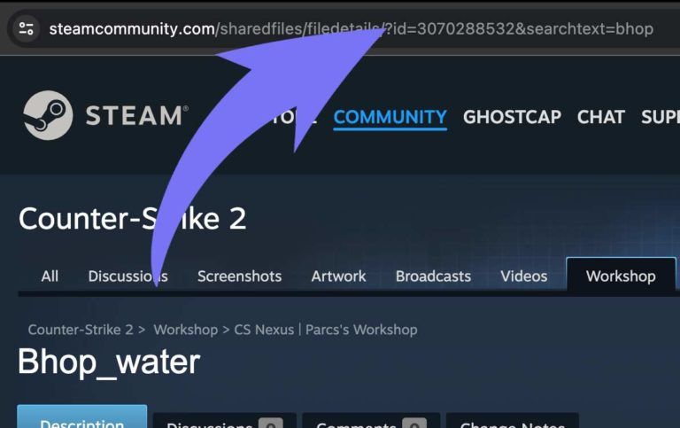
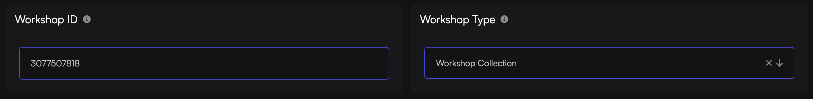

There are 2 different methods you can use for workshop maps. One is by loading a single map or creating a collection.

## How To Get Your Workshop ID

You will need to know how to get a Workshop ID for both single maps and collections. Let's use this map for example: [https://steamcommunity.com/sharedfiles/filedetails/?id=3070288532&searchtext=bhop](https://steamcommunity.com/sharedfiles/filedetails/?id=3070288532&searchtext=bhop)

As you can see from the numbers in the URL, our map ID is `3070288532`

## How To Create And Load Workshop Collection

If you want to have multiple maps, then you will need to create a collection. A workshop collection is simply a group of workshop items. You will also need to modify the startup command for your server.

:::note
Currently there is a CS2 bug where some workshop collections won't load. You can install the [cs2_WorkshopDefaultMap](https://github.com/Cruze03/cs2_WorkshopDefaultMap) plugin to force a map from your collection to load.
:::

**Here is what you need:**
- Workshop Collection with maps you want to use
- A Steam API Key ([get it from here](http://steamcommunity.com/dev/apikey))

Let's first create the collection.

1. Go to the [CS2 Collections page here](https://steamcommunity.com/workshop/browse/?appid=730&section=collections).
2. Click `Create Collection` and add the maps you want to that collection.
3. Get the Collection ID from the URL (using the same method as getting the map ID)
4. Go to your server [Game Host Bros Panel](https://panel.gamehostbros.com/) and select `Configuration > Startup Parameter`
5. Look for `API Authentication Key` and put your Steam API key in there.
6. Make sure `Workshop Type` is set to `Workshop Collection`

7. Select `Workshop ID`, and put your Collection ID in there.
8. Restart the server.

After that, simply restart the server and all the maps will be available. Type `ds_workshop_listmaps` in your console to check.

:::caution
The first time you restart the server with a new collection, it will need to download all the maps, so just leave it without restarting the server and let it finish downloading the files.
:::

## How To Load A Single Map

If you want to play a single workshop map with friends, you only need to know the single Workshop Map ID. Using the Workshop ID from our example above, go to your server and type this into the console: `host_workshop_map 3070288532`. It will then load the map you want. 

If you always want to load this map, then follow these steps.

1. Go to your server in the [Game Host Bros Panel](https://panel.gamehostbros.com/) and select `Configuration > Startup Parameters`.
2. Look for `API Authentication Key` and put your Steam API key in there.
3. Make sure `Workshop Type` is set to `Single Workshop Map`.
4. Select Workshop ID, and put your map ID in there.
5. Restart the server.

## How To Update Workshop Maps

1. Go to your server in the [Game Host Bros Panel](https://panel.gamehostbros.com/).
2. Click `Restart`

## CS2 Workshop Commands

Here are the most common commands you can use.

| Command                      | Description                                                                                                                                                 |
|------------------------------|-------------------------------------------------------------------------------------------------------------------------------------------------------------|
| ds_workshop_changelevel      | Changelevel to an available workshop map by name                                                                                                            |
| ds_workshop_listmaps         | List all available workshop maps from your collection                                                                                                       |