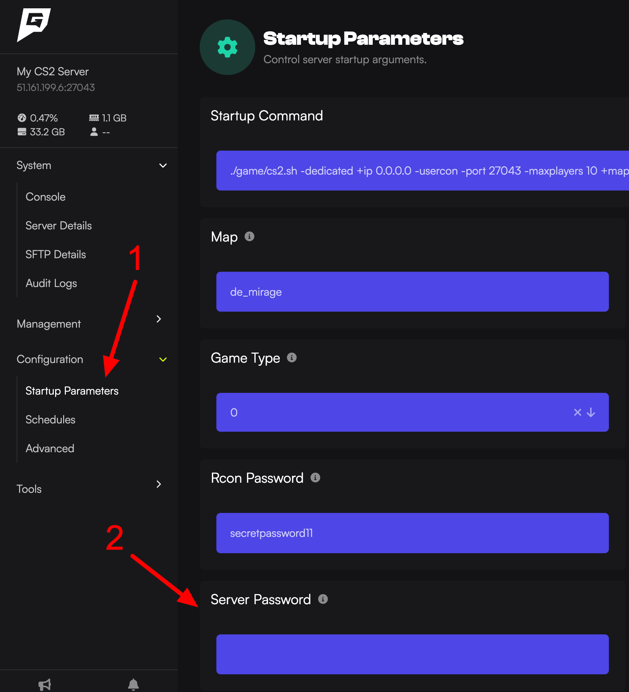

This is what you do if you need to set a password on your Counter Strike 2 server.

1. Access the [Game Host Bros Panel](https://panel.gamehostbros.com/).
2. Click `Startup Parameters`.
3. Look for `Server Password` and then type the password you want.
4. Go back to the console page, then restart your server.

What this does is, it will automatically edit your `/game/csgo/server.cfg` setting for `sv_password`. You can check the password is actually set by typing `sv_password` into the console itself.

In-game clients must [open the console](https://www.youtube.com/watch?v=TY59x-I6wUs) and type `password yourpassword` before they can connect to the server.