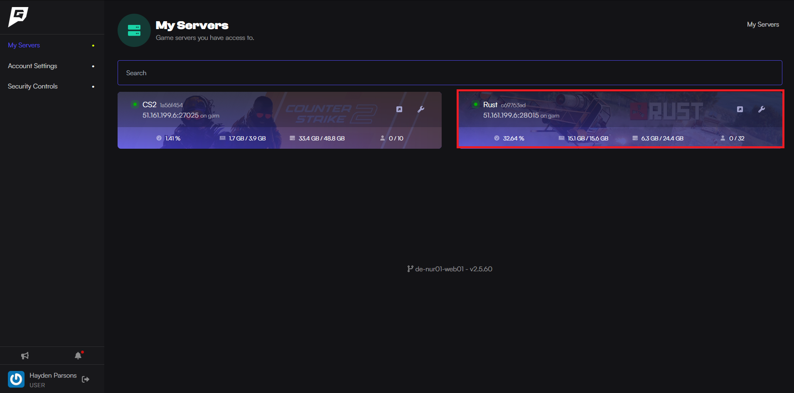

Here is how to add admins to your Rust server.

Before beginning this guide, you should have the SteamID64 of the user you want to add as an admin/moderator.

1. Log into the [Game Host Bros Panel](https://panel.gamehostbros.com). 
2. Select your Rust server.

3. Enter the following command into the console, using the SteamID64 previously obtained:
`moderatorid <STEAMID64> <NAME (or) REASON>`
4. Save the configuration by typing `writecfg` into the console.
5. Restart the server, and the user should now be an admin.
