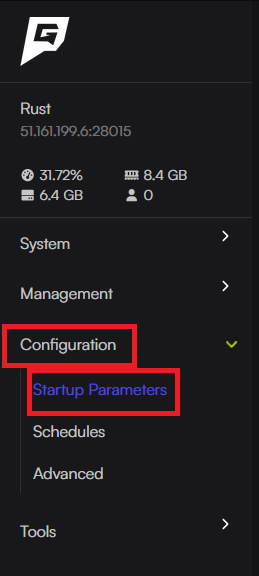

This guide will show you how to edit your Rust server name, description, header image or URL.

:::note
After changing any of these settings, you will need to restart the server for the changes to apply.
:::

## Changing Server Name
1. Access the [Game Host Bros Panel](https://panel.gamehostbros.com/).
2. Select your Rust server.
3. On the left side navigation bar, navigate to "Configuration" and then "Startup Parameters"

4. Once here, under "Server Name" enter the name of your Rust Server
5. You have now changed the server name of your Rust service.

## Changing Server Description
1. Access the [Game Host Bros Panel](https://panel.gamehostbros.com/).
2. Select your Rust server.
3. On the left side navigation bar, navigate to "Configuration" and then "Startup Parameters"

4. Once here, under "Description", enter the description of your server, you can create new lines by typing `\n` followed by the new line.
5. You have now changed the Description of your Rust Service.

## Changing Server Header Image
:::note
The image must either be a 512x256 or 1024x512 image, and its extension should be either .jpg or .png

This will ensure the most optimal image for your Rust Server.
:::
1. Access the [Game Host Bros Panel](https://panel.gamehostbros.com/).
2. Select your Rust server.
3. On the left side navigation bar, navigate to "Configuration" and then "Startup Parameters"

4. Once here, under "Server Image", enter the URL that points to your server image.
5. You have now changed the server header image for your server.