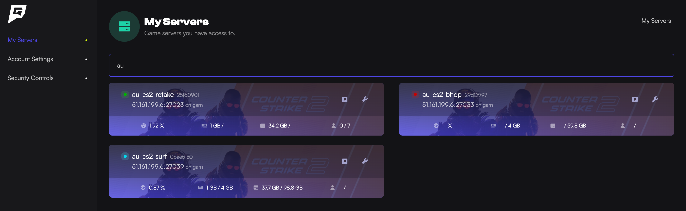
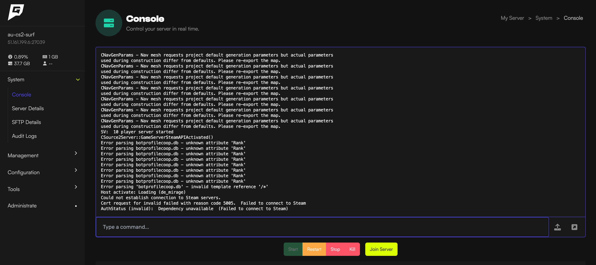
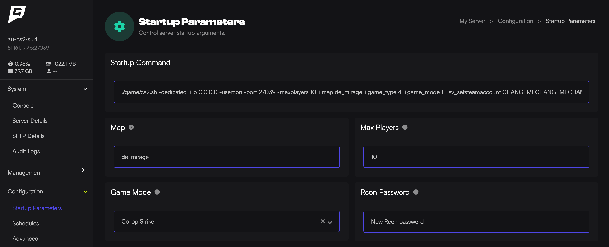
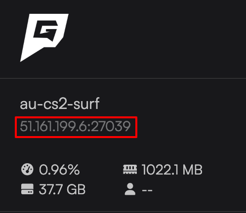

In this guide I’ll show you the basics of running your new Game Host Bros server. Think of this as a crash course into game server hosting.

If you don't have a server with us yet, [click here](https://www.gamehostbros.com/) and get one now.

:::note
If you get stuck at any time or have questions, don’t be afraid to reach out to a bro with a support ticket or on [Discord](https://discord.gg/FN4XgbAwzr). We are here to help you get everything set up the way you want it.
:::

## The Game Panel
After you sign up and pay for your Game Host Bros server, you will be sent an email that asks you to sign in to our Game Panel. Once you click the link in the email, it will bring you to an overview of all the servers you have with us.

## Starting & Stopping Your Server
Once you’re in the game panel, you can simply click the server you want to manage, and you will be brought to the server `Console`. This is where you can `Start`,`Stop`, `Restart` your server and type commands. 

## Edit Server Settings
In the sidebar click `Configuration > Startup Parameters`

This is where you will edit most of the basic settings for your server such as the servers public name, maximum players, setting a password and changing game modes. After any change made here, you will need to restart the server.

:::note
These settings are different for each game.
:::

## Connect To Your Server
To connect your server, you will need the IP address. We display this at the top left of every page. Simply click on it to copy. How you connect using the IP address is different for each game, but we include a "Connect to Your Server" guide for each game in the sidebar here.

Congratulations 🎉 you've finished the beginners guide crash course! See it wasn't that hard. Now check out the other guides we have here to find out how to do other things like adding other users to your server, game specific guides and more.

Remember, the bros always have your back so come and [join our Discord](https://discord.gg/FN4XgbAwzr) and let's get your server set up the way you want it.