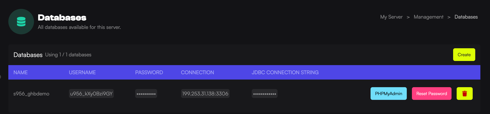

This article will guide you through the process of creating a MySQL database for your game server, which is used by some plugins to store data.

1. Load the [Game Host Bros Panel](https://panel.gamehostbros.com/).
2. Select your server.
3. In the left-hand menu, click `Management > Databases`.
4. Click the `Create` button.
5. Locate the plugin you'd like to use the MySQL database for. Open the plugin's configuration file and input the database details correctly.
6. Restart your server.

:::note
- Resetting your database will remove all the information in that database.
- Backups do not include databases.
- The MySQL port is always, 3306.
- If you want to use 127.0.0.1, it is now 172.200.0.1
:::