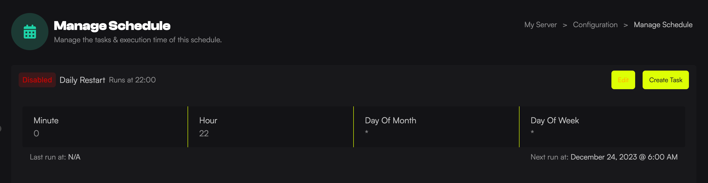

You can set up schedules to restart your server, send commands, or do game-specific tasks such as wiping Rust servers.

:::note
When setting up the schedule, the time is in UTC +0. We suggest you restart your servers at least once every 24 hours for the best possible performance.
:::

1. Load the [Game Host Bros Panel](https://panel.gamehostbros.com/).
2. Select your server.
3. In the left-hand menu, click `Configuration > Schedules`.
4. Click the `Create` button.
5. Give your schedule a name, in this example we will use "Restart" as the name.
6. Put in the time you want the server to perform the action [in cron format](https://crontab.guru/). For example, to run the Restart at 10 UTC, I would put in 0 10 * * *.
7. It will now say AT 10:00, Next run at November 29, 2023 @ 6:00 PM. That means at 6:00PM your time the schedule will run.
8. Click Submit and then `Create Task` on the top right and select the type of Task you want to perform. Example: we use power action, and restart.

If you have multiple tasks you want to run, for example you want to run a save command then then restart the server, you can use the `Time Offset` function. This is measued in seconds and its the delay from when your last task was run.

Here is a video we've made for schedules. While the Game Panel looks slightly different, the functionality is the same.

<iframe src="//www.youtube.com/embed/MyIA9kse-Ec" allowfullscreen="allowfullscreen"></iframe>

## Popular Times

Here is a list of popular times in cron format.

| Schedule         | Crontab Entry         |
|------------------|-----------------------|
| Every 1 hour     | `0 * * * *`           |
| Every 2 hours    | `0 */2 * * *`         |
| Every 4 hours    | `0 */4 * * *`         |
| Every day        | `0 0 * * *`           |
| Every week       | `0 0 * * 0`           |
