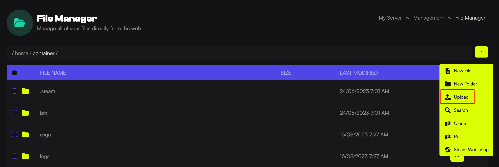

This guide will walk you through the process of uploading files on your game server using the File Manager or [Filezilla](https://filezilla-project.org/download.php?show_all=1).

## Using the File Manager

Using the File Manager is suitable for when you need to upload a small single file or edit an existing config.

1. Load the [Game Host Bros Panel](https://panel.gamehostbros.com/).
2. Select your server.
3. In the left-hand menu, click `Managment > File Manager`.
4. Press the 3 dots on the top right and click `Upload`.

## Using SFTP
This method is suitable if you're uploading multiple files or large files.

1. Load the [Game Host Bros Panel](https://panel.gamehostbros.com/).
2. Select your server.
3. In the left-hand menu, click `System > SFTP Details`.
4. Open FileZilla and locate the `Quickconnect` bar.
5. Enter the SFTP connection address you obtained from the game panel into the `Host` field.
6. Input the `username` and the `password`. The password is the same you use to log in to the Game Panel.
7. Click the `Quickconnect` button.

Once connected, you'll see your local files on the left side of the FileZilla window and your game server files on the right side. To upload files, simply locate the files on your local machine (left side), and drag and drop them to the desired location on your game server (right side).